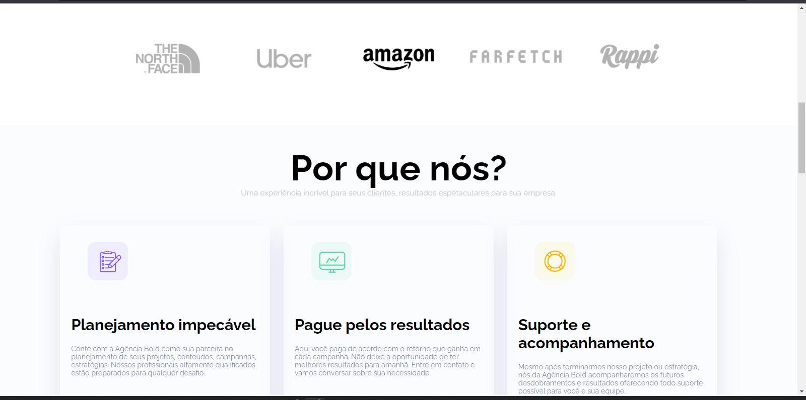
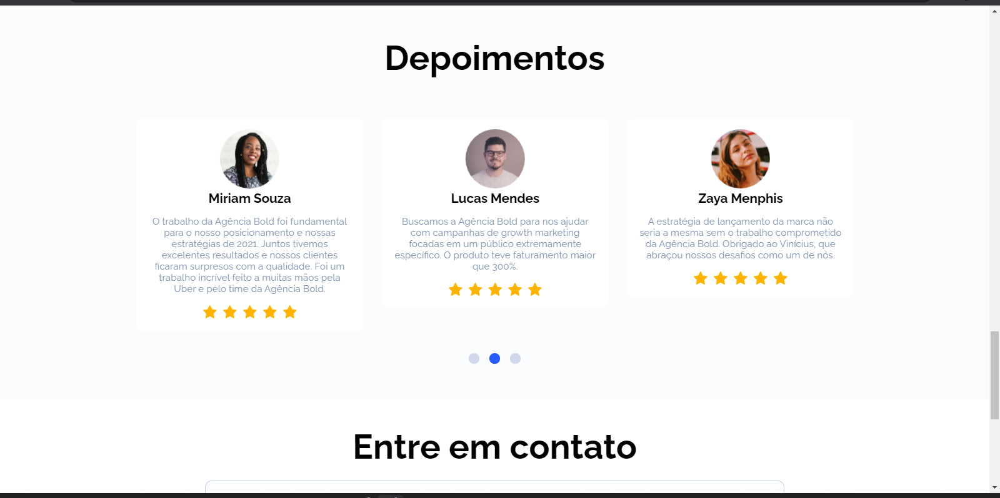
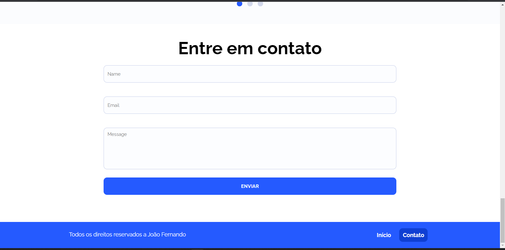

# Agência Bold

 
 

Projeto desenvolvido junto com a DankiCode no curso Front-End 2.0

Tecnologias utilizadas:
    - Jquery 
    - JavaScript 
    - CSS
    - HTML 
    - PHP 

Esse projeto foi desenvolvido com o intuito de consolidar o aprendido no curso e depois eu aprimorei algumas coisas para usar também tecnologias de backend